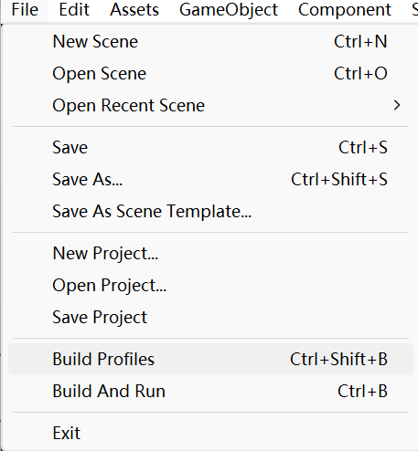
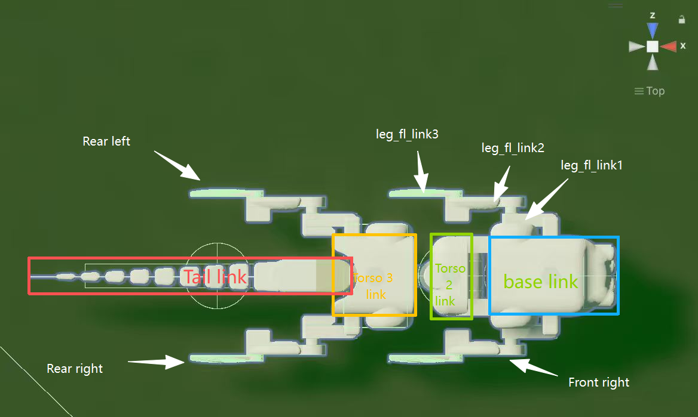
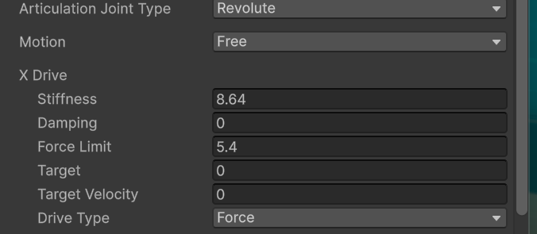
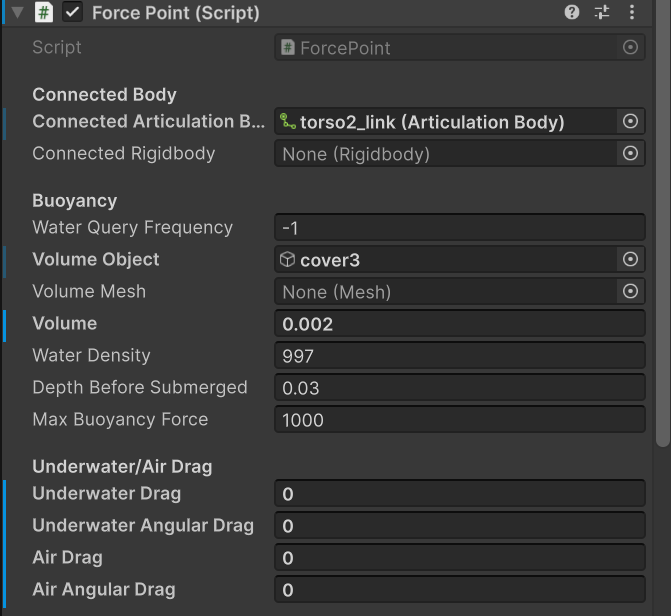
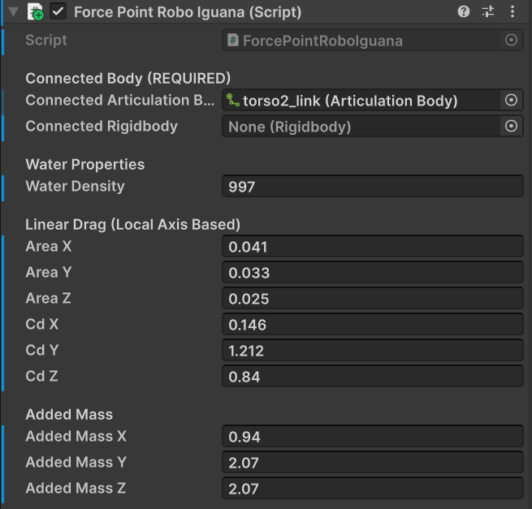
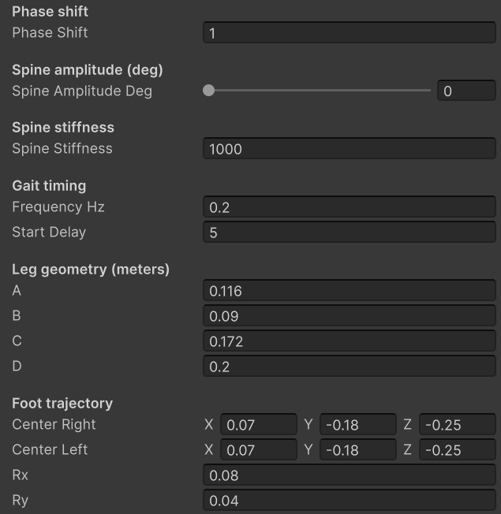
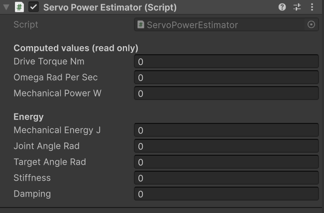

# SMARC Unity

This project has all of the dependencies configured and installed in order to run assets from [SMARC Assets package](https://github.com/smarc-project/SMARCAssets) with minimal effort.

It uses HDRP, so you are going to need at least a dedicated GPU on your machine to run this smoothly.

See the README of [SMARC Assets package](https://github.com/smarc-project/SMARCAssets) for setup, citation and documentation.

# RoboIguana Unity Project

Unity-based simulation model of **RoboIguana**, an underwater legged robot built in **SMaRC Unity** using **Articulation Bodies**. 

---

## Table of Contents

- [Overview](#overview)
- [Prerequisites](#prerequisites)
- [Project Workflow](#project-workflow)
- [Quick Start](#quick-start)
- [Robot Modelling](#robot-modelling)
  - [Body Structure](#body-structure)
  - [Spine Joints](#spine-joints)
  - [Leg Structure](#leg-structure)
  - [Foot Trajectory and Inverse Kinematics](#foot-trajectory-and-inverse-kinematics)
- [Joint Modelling](#joint-modelling)
- [Hydrodynamic Modelling](#hydrodynamic-modelling)
- [Main Scripts](#main-scripts)
  - [`ExperimentRunner.cs`](#experimentrunnercs)
  - [`RoboIguanaIKController`](#roboiguanaikcontroller)
  - [`RecordPosition`](#recordposition)
  - [`TotalEnergyRecorder`](#totalenergyrecorder)
  - [`ServoPowerEstimator`](#servopowerestimator)
  - [`ForcePointRoboIguana`](#forcepointroboiguana)
- [Outputs](#outputs)
- [Recommended Folder/Documentation Additions](#recommended-folderdocumentation-additions)
- [Notes](#notes)

---

## Overview

RoboIguana is modelled in Unity as a **multi-body articulated system**. The robot is built from articulation bodies connected by revolute joints, with dynamics handled through Unity's **Articulation Body** framework. This enables physically consistent modelling of mass, inertia, gravity, joint constraints.


The project is intended for simulation studies where MATLAB sends parameters to Unity, Unity runs the robot simulation, and MATLAB later post-processes the resulting motion and energy data.

---

## Prerequisites

Before working on this project, read the documentation for:

- [**SMARCAssets**](https://github.com/smarc-project/SMARCAssets)
- [**SMARCUnity**](https://github.com/smarc-project/SMARCUnity)

RoboIguana is built within the SMaRC Unity ecosystem.

- Put the **RoboIguana** file at "the location where you put SMARCAssets\SMARCAssets\Runtime\Models"
- Put the **ForcePointRoboIguana.cs**  and  **ForcePoint.cs**  at "the location where you put SMARCAssets\SMARCAssets\Runtime\Scripts\Force"

---

## Project Workflow

The overall workflow is:

```text
MATLAB
  -> ExperimentRunner
  -> RoboIguanaIKController
  -> Unity simulation
  -> Position and energy logging
  -> MATLAB post-processing
```

### Data flow

1. MATLAB sends simulation parameters.
2. `ExperimentRunner.cs` reads the parameters and forwards them to `RoboIguanaIKController`.
3. Unity runs the simulation.
4. Position and energy data are recorded.
5. MATLAB scripts generate trajectory plots and summary metrics.

---

## Quick Start

### 1. Build the Unity project

Export the Unity project as an executable using **Build Profiles**.


### 2. Run the experiment from MATLAB

Run:

```matlab
experimentrunner.m
```

If `ExperimentRunner.cs` is modified, update the MATLAB script accordingly.

This step records simulation outputs such as:

- robot position
- mechanical energy

The results are saved to CSV files with descriptive filenames.

### 3. Post-process the outputs

Run:

```matlab
plotrajectory.m
```

This script:

- visualises the centre-of-mass trajectory for each run
- computes summary performance metrics
- saves processed results into `experiment_summary.csv`

The main summary metrics are:

- **cost of transport**
- **speed**
- **deviation**

---

## Robot Modelling

## Body Structure

RoboIguana is divided into multiple articulated segments.

- The **first torso segment** is treated as the **base link**.
- The **second torso segment** is connected to the first torso.
- The **third torso segment** is connected to the second torso.
- A **flexible tail** is connected to the third torso.

The base link acts as the reference body for the rest of the robot.
 
## Spine Joints

The spine is modelled using revolute joints.

### Torso 1 (base link) to Torso 2

- **Joint type:** revolute
- **Rotation axis:** `z`
- **Function:** bending in the sagittal plane

### Torso 2 to Torso 3

- **Joint type:** revolute
- **Rotation axis:** `y`
- **Function:** lateral spine motion

### Torso 3 to Tail

- **Joint type:** revolute
- **Rotation axis:** `y`
- **Function:** tail motion

## Leg Structure

RoboIguana has **4 legs**:

- **2 front legs** attached to the first torso segment
- **2 rear legs** attached to the third torso segment

Each leg consists of **3 rotational joints**, all modelled as revolute joints in Unity.

### Leg joints

#### Shoulder joint

- **Rotation axis:** `y`

#### Hip joint

- **Rotation axis:** `z`

#### Knee joint

- **Rotation axis:** `z`

These 3 joints work together to control the foot tip.

## Foot Trajectory and Inverse Kinematics

The foot tip of each leg follows a predefined trajectory.

- The desired foot-tip path is an **ellipse in the `xy` plane**.
- The required joint angles are obtained using **inverse kinematics**.

Leg coordination is organised in diagonal pairs:

- **front left** and **rear right**
- **front right** and **rear left**

---

## Joint Modelling

In this project, revolute joints also represent **servo actuation**.


### Stiffness settings

If the servo motor is connected through a **series elastic actuator** with stiffness:

```text
8.64 Nm/rad
```

then the revolute joint stiffness can be set to:

```text
8.64 Nm/rad
```

This follows the simplified spring-in-series assumption used in the project.

If the servo motor is assumed to be directly connected between 2 links and modelled as an ideal servo, use:

```text
1000 Nm/rad
```

to approximate a very stiff actuator.

---

## Hydrodynamic Modelling

The hydrodynamic model is simplified. Only the following effects are considered:

- **buoyant force**
- **drag force**
- **added mass force**

For each link, all hydrodynamic effects are concentrated at a **single force point**.

### Force implementation

#### Buoyant force

Buoyancy is implemented using the standard [**ForcePoint**](https://github.com/smarc-project/SMARCAssets/tree/master/Documentation#force) component in SMaRC Unity.

To adjust buoyancy, modify:

- `Volume`
  

#### Drag force and added mass force

Drag and added mass are implemented using:

- `ForcePointRoboIguana`


To adjust these effects, modify the parameters in the `ForcePointRoboIguana` script.

---

## Main Scripts

## `ExperimentRunner.cs`

This script manages the simulation from the Unity side.

### Responsibilities

- receives commands from MATLAB
- reads experiment parameters
- sends important parameters to `RoboIguanaIKController`


### Current parameters read from MATLAB

- `phaseshift`
- `frequency`
- `stiffness`
- `amplitude`

If you want MATLAB to control additional parameters, such as leg trajectory settings, this script must be extended accordingly.

If MATLAB control is not needed, this script can be removed.

## `RoboIguanaIKController`

This is the main control scripts in the project.
 

### Editable parameters

- phase shift
- lateral spine amplitude
- lateral spine stiffness
- gait frequency
- foot trajectory parameters

### Main functions

- generates robot motion
- performs inverse kinematics
- maps desired foot trajectories to joint angles

### Important note

Do **not** modify the leg geometry unless you are confident about the consequences, because the inverse kinematics depends on those dimensions.

## `RecordPosition`

This script records the **centre-of-mass position** of the robot throughout the simulation.

## `TotalEnergyRecorder`

This script accumulates the total mechanical energy estimated during the whole simulation.

## `ServoPowerEstimator`

This script calculates:

- mechanical power of one motor
- total mechanical energy consumed by that motor
 
### Usage

Attach it to an **Articulation Body** with a **revolute joint**.

### Notes

- stiffness does not need to be entered manually
- damping does not need to be entered manually
- both values are automatically read from the revolute joint settings

## `ForcePointRoboIguana`

This script is used to define:

- drag coefficients
- added mass coefficients

It is the main place to tune the simplified hydrodynamic model beyond buoyancy.

---

## Outputs

The project records and processes several outputs.

### Raw outputs

Typically saved as CSV files:

- position data
- energy data

### Processed outputs

Saved to `experiment_summary.csv`:

- speed
- deviation
- cost of transport

### Visual outputs

Saved to folder 'trajectory_plots':

- centre-of-mass trajectory plots

---


## Notes

- Keep parameter definitions in MATLAB and Unity consistent.
- If `ExperimentRunner.cs` changes, update `experimentrunner.m` accordingly.
- Avoid changing leg dimensions unless the inverse kinematics is also reviewed.
- Document any hydrodynamic tuning clearly, since the current force model is intentionally simplified.
- Use descriptive output filenames so that batch simulation results remain easy to trace.

---

## Acknowledgements

This project is built on top of the **SMARCUnity** and **SMARCAssets** ecosystem.
